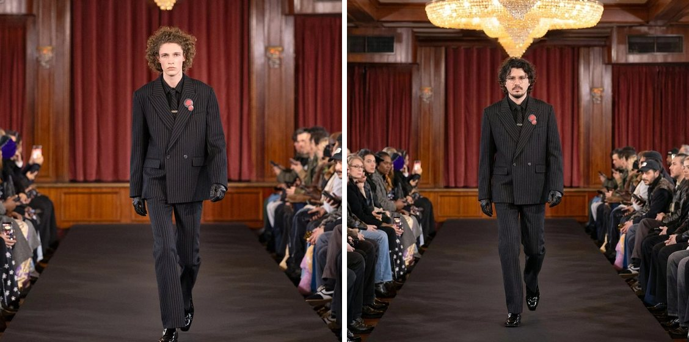
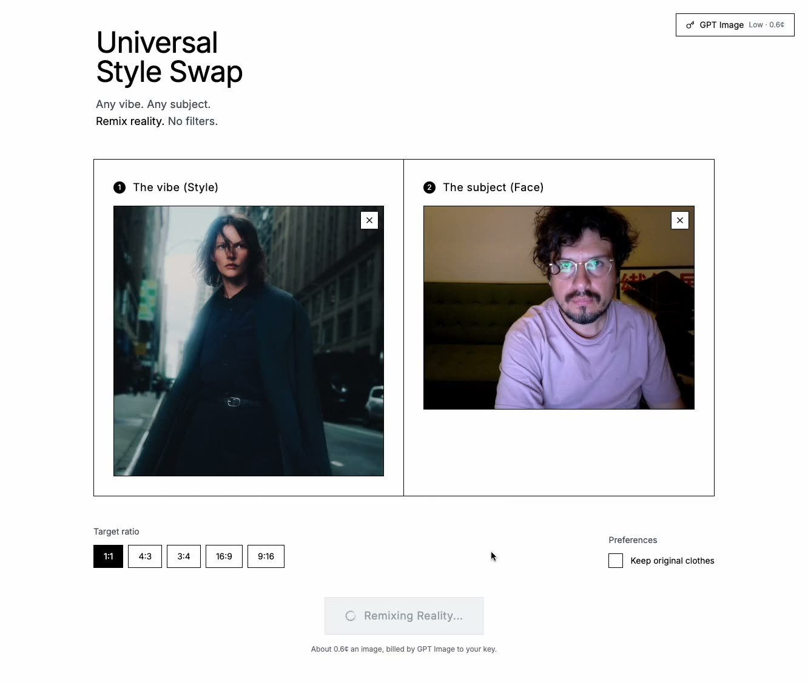

# Universal Style

One image wearing another's look. Give it a reference photograph and a face: it
rebuilds the reference — the light, the room, the lens, the outfit — with your
person in it, and keeps the face recognisably theirs.

It runs on your machine and bills your own API key. There is no account, no
credit, no server in between.




## Why

Every tool that can do this is an application: layers, masks, a model picker, a
strength slider, a seed, a negative prompt, a gallery, a workspace. Getting one
picture out becomes a session, and most of the time what you wanted was a single
action.

Krea and Higgsfield are better than this at almost everything — they are built
for exploring. This is built for the other case: one specific picture, from these
two images, at this ratio, now, on your own account.

## Install

```bash
git clone git@github.com:davidbastian/styles-swap.git
cd styles-swap && npm install
npm run dev
```

React 19, TypeScript, Vite. No server, no build step to deploy, nothing to sign
up for. Open it, paste a key, use it.



## Your key, your bill

Gemini or GPT Image, whichever you already have a key for. Paste it once and it
stays in `localStorage` on the machine that typed it — there is no server here to
send it to.

Quality lives on the key in the corner, with what each level costs per image:

| Provider | Level | Model | ~per image |
| --- | --- | --- | --- |
| Google | Draft | `gemini-2.5-flash-image` | $0.04 |
| Google | Best | `gemini-3-pro-image-preview` | $0.13 |
| GPT Image | Low | `gpt-image-2` | $0.006 |
| GPT Image | Medium | `gpt-image-2` | $0.05 |
| GPT Image | High | `gpt-image-2` | $0.21 |

It opens at the cheapest level, which is usually enough. Rates are the
providers' own list prices in September 2026 and exclude the two photographs you
send, which are billed as input.

Two providers and deliberately no more: the swap is a single request, so a router
would be half an hour's work, but a menu of seven services is a complication
before the first picture. Open an issue if you want another one in there.

## The recipe is a skill

What the model is told is the product. Everything it does well here it does
because one paragraph is specific about what must survive — the face — and
permissive about everything else.

So that paragraph is not a constant in TypeScript. It lives in
[`skills/style-swap/SKILL.md`](skills/style-swap/SKILL.md): frontmatter saying
what the skill takes and returns, then one section per thing the app might need
to say — the instruction, the two clothing rules, and the three things to try
when a model refuses. Vite inlines it with `?raw`, so there is still nothing to
fetch at runtime, but the instruction is prose, it diffs like prose, and you can
rewrite it without reading a line of code.

Yes, you could fine-tune your own model for a look. That is a different job.
This is a fast, precise instruction you can read, edit and aim at whatever you
need today.

## Why it always works

Send a model two photographs of people and it will sometimes decline, for a
reason nobody can act on. So a refusal is not an error here, it is the next step:

1. Both images, straight in.
2. The reference redrawn without its face, then the swap again.
3. The reference described in words, with no photograph of it sent at all.

The face is protected in all three. Everything else is replaceable. The
intermediate image in step 2 is always generated at the draft level — nobody
sees it, so it should not cost what the final one costs.

## What you can change

| Control | What it does |
| --- | --- |
| The vibe | The reference image: its light, setting, framing, outfit. |
| The subject | The face to keep — dropped in, or taken there and then with the camera. |
| Ratio | 1:1, 4:3, 3:4, 16:9, 9:16. |
| Keep clothes | Off, the subject wears the reference's outfit. On, their own clothes stay and only the light and the room change. |
| Quality | On the key, each level priced. |

## Not a service

The tool is free. You pay for the model, directly to Google or OpenAI and to
nobody else — there is no margin on top, because the wrapper is this repository
and a folder you cloned.
